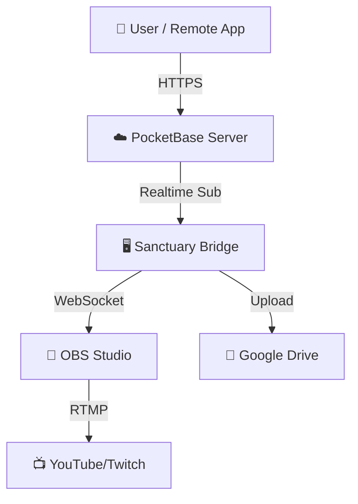

# Sanctuary Stream

**Zero-Trust Church Streaming Control System**

[](https://github.com/brentmzey/sanctuary-stream/actions/workflows/build-release.yml)
[](https://opensource.org/licenses/MIT)

> **Professional Remote Control for OBS Studio.**
> Control your church stream from anywhere—iPhone, Android, Web, or Desktop. Secure, open-source, and free forever.

---

## 🚀 Quick Start (Automated)

The fastest way to get a local development environment running is our automated setup script:

```bash
# Clone the repository
git clone https://github.com/brentmzey/sanctuary-stream.git
cd sanctuary-stream

# Run the automated setup
npm run setup
```

This script will:
- Check for prerequisites (Node.js, PocketBase)
- Install all dependencies
- Start a local PocketBase server
- Automatically create admin and test accounts
- Configure your `.env` files with the correct Stream IDs
- Prepare the Bridge and App for launch

---

## 🗺️ High-Level Overview

Sanctuary Stream works by connecting **Remotes** (phones/laptops) to a **Station** (your streaming computer) via a secure **Cloud/Local Server**.

1.  🖥️ **The Station:** The powerful PC running OBS Studio + Our Bridge software.
2.  ☁️ **The Federation Server:** A PocketBase instance (cloud or local) that connects everyone.
3.  📱 **The Remotes:** The App running on your device to control the Station.

---

## 🚀 Step-by-Step Setup Guide

Follow this path to build your complete broadcasting system.

### Phase 1: The "Station" (Streaming PC) Setup
*The computer that actually sends video to YouTube.*

1.  **Install OBS Studio:**
    *   Download and install [OBS Studio](https://obsproject.com/).
    *   Configure your scenes, cameras, and audio.
    *   **👉 Deep Dive:** [See `docs/OBS_INTEGRATION.md`](./docs/OBS_INTEGRATION.md) for HD/4K settings.

2.  **Install the Sanctuary Bridge:**
    *   This small program runs on the Station. It listens for commands from the cloud and tells OBS what to do.
    *   **Setup:** Ensure you have Node.js installed, then run the bridge.
    *   **Integrations:** Add your Google Drive credentials for auto-uploading.
    *   **👉 Deep Dive:** [See `docs/INTEGRATIONS.md`](./docs/INTEGRATIONS.md) for Drive & YouTube setup.

### Phase 2: The Federation Server (Sign Up & Connect)
*The secure link between your phone and the computer.*

You need a central place for devices to "meet". We use **PocketBase**. You have two options:

**Option A: Cloud (Easiest - "Federated")**
1.  Go to [PocketHost.io](https://pockethost.io) (or any PocketBase hosting).
2.  Create a new backend (e.g., `https://my-church.pockethost.io`).
3.  **Schema Setup:** Upload the files from `pocketbase/pb_migrations/` to your cloud instance's migrations folder, or use the PocketBase Admin UI to create the `users`, `commands`, and `streams` collections.
4.  This URL is your **"Federation Key"**. You will type this into the App and the Bridge.

**Option B: Self-Hosted (Local Only)**
1.  Download the `pocketbase` executable (for your OS) from [pocketbase.io](https://pocketbase.io/docs/).
2.  Place it in the `pocketbase/` directory of this repo.
3.  Run `./pocketbase serve`. The schema will be **automatically created** via the included migrations in `pb_migrations/`.
4.  Your URL is `http://127.0.0.1:8090` (works only on local WiFi).

**👉 Deep Dive:** [See `docs/MULTI_BACKEND.md`](./docs/MULTI_BACKEND.md) for configuring 245+ instances.

### Phase 3: The "Remote" (App) Deployment
*Get the app on everyone's devices.*

Sanctuary Stream runs on **everything**.

| Platform | How to Install | Guide |
| :--- | :--- | :--- |
| **iPhone / iPad** | Download from App Store / Build with Xcode | [iOS Guide](./docs/INSTALLATION_DISTRIBUTION.md#ios) |
| **Android** | Download APK / Play Store | [Android Guide](./docs/INSTALLATION_DISTRIBUTION.md#android) |
| **Web Browser** | Visit your deployed URL (e.g., Vercel) | [Web Guide](./docs/INSTALLATION_DISTRIBUTION.md#web) |
| **Mac** | Download `.dmg` from Releases | [Desktop Guide](./docs/USER_GUIDE.md) |
| **Windows** | Download `.msi` from Releases | [Desktop Guide](./docs/USER_GUIDE.md) |
| **Linux** | Download `.deb` or `.AppImage` | [Desktop Guide](./docs/USER_GUIDE.md) |

**👉 Deep Dive:** [See `docs/INSTALLATION_DISTRIBUTION.md`](./docs/INSTALLATION_DISTRIBUTION.md) for all app store links.

---

## 🔗 Connecting It All

Once installed:

1.  **Start the Bridge** on your PC:
    ```bash
    # Update .env with your Server URL (e.g., https://my-church.pockethost.io)
    npm run start
    ```
2.  **Open the App** on your phone.
3.  **Enter Server URL:** Type in `https://my-church.pockethost.io`.
4.  **Login:** Use the credentials created in your PocketBase dashboard.
5.  **Control:** You should see the "Start Streaming" button light up!

---

## 🆘 Support & Community

We are committed to helping your ministry succeed.

**Where to get help:**

1.  **Documentation:** Check the `./docs` folder first. It contains 20,000+ words of guides.
    *   [⚡ Quick Reference](./docs/QUICK_REFERENCE.md) (Common problems solved fast)
    *   [🧙 User Onboarding](./docs/USER_ONBOARDING.md) (First time setup)
2.  **Issues:** File a bug report on [GitHub Issues](https://github.com/brentmzey/sanctuary-stream/issues).
3.  **Email Support:** Contact the core maintainers at `support@sanctuarystream.org` (Replace with actual email if available, or maintainer personal email).

**Contributing:**
We welcome PRs! Please read [`CONTRIBUTING.md`](./CONTRIBUTING.md) and [`docs/FUNCTIONAL_STYLE.md`](./docs/FUNCTIONAL_STYLE.md) before submitting code.

---

## 🏗️ Technical Architecture



**Philosophy:** Zero-Trust Security, Pure Functional Programming, 100% Free.

---

*Copyright © 2026 Sanctuary Stream Contributors. Released under the MIT License.*