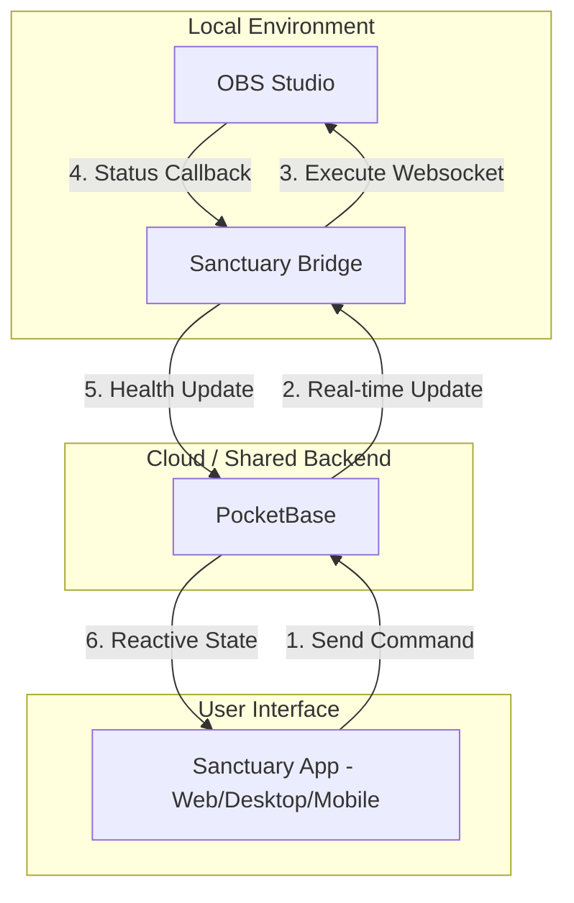

# 🏗️ SRVDD - Service Runtime & Visual Design Document

This document provides a technical overview of the **Sanctuary Stream** architecture and runtime service design.

## 📐 System Architecture

The system consists of three main components:
1.  **Sanctuary App:** Frontend UI (Tauri/Web/Capacitor).
2.  **PocketBase:** Zero-trust database and identity provider.
3.  **Sanctuary Bridge:** Background worker connecting PocketBase to OBS.

### 📊 Service Interaction Diagram

## ⚙️ Service Runtime Design

| Service | Port | Runtime | Responsibility |
| :--- | :--- | :--- | :--- |
| **PocketBase** | 8090 | Golang (Standalone) | Auth, Database, Webhooks, File storage. |
| **Sanctuary Bridge** | N/A | Node.js (Worker) | Listens to `commands` collection, controls OBS. |
| **Sanctuary App** | 5173 | Vite / React | User dashboard, stream health monitor. |
| **Mock OBS** | 4455 | Node.js (Script) | Simulates OBS WebSocket server (v5). |

## 🛡️ Zero-Trust Design Principles

1.  **Identity-First:** No action can be taken without a PocketBase JWT token.
2.  **Command-Queue:** The App never talks to the Bridge directly. All actions are records in the `commands` collection.
3.  **Least Privilege:** The `bridge` user only has access to specific collections and cannot modify user accounts.
