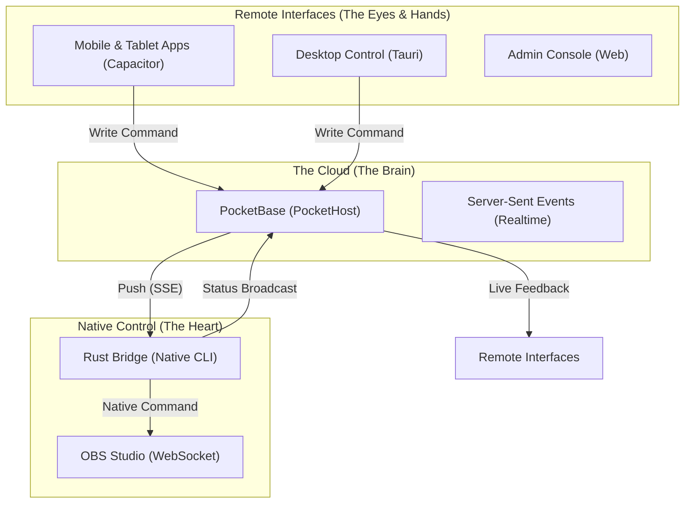
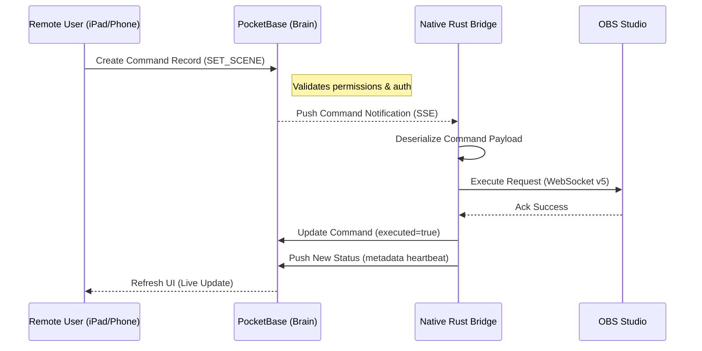

# 🏗️ Sanctuary Stream Architecture

Sanctuary Stream is built on a **High-Performance, Secure, and Monadic** architecture designed to bridge the gap between high-level cloud orchestration and low-latency native hardware control.

## 🏛️ System Overview

The system is composed of three primary "Pillars" that interact via a secure, zero-trust communication layer.

---

## ⚡ Command Dispatch Lifecycle

When a volunteer taps "Cut" or "Auto" on a tablet, the following flow ensures sub-second execution logic.

---

## 📦 Data Model

Sanctuary Stream uses a functional, type-safe data model implemented in both Rust and TypeScript.

- **Streams**: Current broadcast status, bitrate, FPS, and live scene metadata.
- **Commands**: Immutable log of all remote actions (audit trail).
- **Sermons/Liturgy**: Structured content managed via the PocketBase admin.
- **Parishes**: Multi-tenant configuration for SaaS scale.

## 🔒 Security Principles

1.  **Zero-Trust Commands**: Every command is signed and verified at the database level before it reaches the hardware.
2.  **Monadic Error Handling**: Use of `Result` and `Option` types ensures that hardware failures (like OBS disconnecting) are handled gracefully without crashing the UI.
3.  **Local Encryption**: sensitive OBS credentials are never stored in the cloud; they stay on the streaming machine.

---

## 🚀 Native Performance

The **Bridge** is a native binary compiled for the target OS (x86_64 or ARM64), ensuring that the overhead between receiving a network packet and controlling your video hardware is measured in **microseconds**, not milliseconds.
